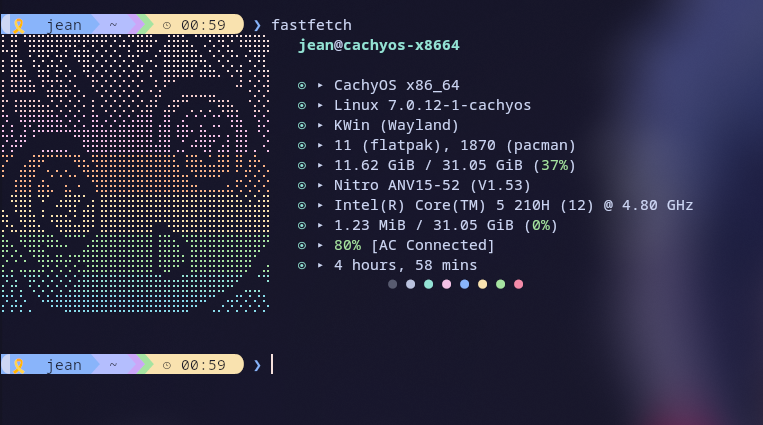
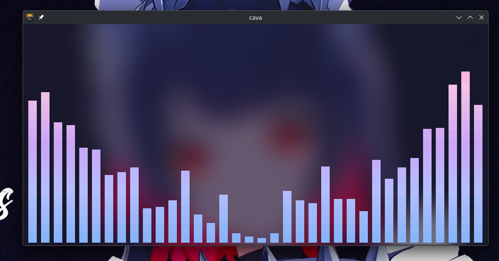

# Dotfiles — Fastfetch + Kitty + Starship

Configuración estética para **Hyprland** con tema **Catppuccin Mocha**.





## 📸 Preview

```
⣇⣿⠘⣿⣿⣿⡿⡿⣟⣟⢟⢟⢝⠵⡝⣿⡿⢂⣼⣿⣷⣌⠩⡫⡻⣝⠹⢿⣿⣷   jean@cachyos-x8664
⡆⣿⣆⠱⣝⡵⣝⢅⠙⣿⢕⢕⢕⢕⢝⣥⢒⠅⣿⣿⣿⡿⣳⣌⠪⡪⣡⢑⢝⣇   
⡆⣿⣿⣦⠹⣳⣳⣕⢅⠈⢗⢕⢕⢕⢕⢕⢈⢆⠟⠋⠉⠁⠉⠉⠁⠈⠼⢐⢕⢽    ▸ CachyOS x86_64
⡗⢰⣶⣶⣦⣝⢝⢕⢕⠅⡆⢕⢕⢕⢕⢕⣴⠏⣠⡶⠛⡉⡉⡛⢶⣦⡀⠐⣕⢕    ▸ Linux 7.0.12-1-cachyos
⡝⡄⢻⢟⣿⣿⣷⣕⣕⣅⣿⣔⣕⣵⣵⣿⣿⢠⣿⢠⣮⡈⣌⠨⠅⠹⣷⡀⢱⢕    ▸ KWin (Wayland)
⡝⡵⠟⠈⢀⣀⣀⡀⠉⢿⣿⣿⣿⣿⣿⣿⣿⣼⣿⢈⡋⠴⢿⡟⣡⡇⣿⡇⡀⢕    ▸ 11 (flatpak), 1870 (pacman)
⡝⠁⣠⣾⠟⡉⡉⡉⠻⣦⣻⣿⣿⣿⣿⣿⣿⣿⣿⣧⠸⣿⣦⣥⣿⡇⡿⣰⢗⢄    ▸ 10.91 GiB / 31.05 GiB (35%)
⠁⢰⣿⡏⣴⣌⠈⣌⠡⠈⢻⣿⣿⣿⣿⣿⣿⣿⣿⣿⣿⣬⣉⣉⣁⣄⢖⢕⢕⢕    ▸ Nitro ANV15-52 (V1.53)
⡀⢻⣿⡇⢙⠁⠴⢿⡟⣡⡆⣿⣿⣿⣿⣿⣿⣿⣿⣿⣿⣿⣿⣿⣿⣿⣷⣵⣵⣿    ▸ Intel(R) Core(TM) 5 210H (12) @ 4.80 GHz
⡻⣄⣻⣿⣌⠘⢿⣷⣥⣿⠇⣿⣿⣿⣿⣿⣿⠛⠻⣿⣿⣿⣿⣿⣿⣿⣿⣿⣿⣿    ▸ 1.25 MiB / 31.05 GiB (0%)
⣷⢄⠻⣿⣟⠿⠦⠍⠉⣡⣾⣿⣿⣿⣿⣿⣿⢸⣿⣦⠙⣿⣿⣿⣿⣿⣿⣿⣿⠟    ▸ 80% [AC Connected]
⡕⡑⣑⣈⣻⢗⢟⢞⢝⣻⣿⣿⣿⣿⣿⣿⣿⠸⣿⠿⠃⣿⣿⣿⣿⣿⣿⡿⠁⣠    ▸ 4 hours, 43 mins
⡝⡵⡈⢟⢕⢕⢕⢕⣵⣿⣿⣿⣿⣿⣿⣿⣿⣿⣶⣶⣿⣿⣿⣿⣿⠿⠋⣀⣈⠙             ● ● ● ● ● ● ● ●
⡝⡵⡕⡀⠑⠳⠿⣿⣿⣿⣿⣿⣿⣿⣿⣿⣿⣿⣿⣿⣿⠿⠛⢉⡠⡲⡫⡪⡪⡣   
```

## 📂 Estructura

```
dotfiles/
├── cava/
│   └── config              # cava visualizer con gradiente Catppuccin
├── fastfetch/
│   ├── config.jsonc        # Configuración de fastfetch
│   └── ascii/
│       └── logo.txt        # ASCII art de Shiroko
├── kitty/
│   └── kitty.conf          # Kitty terminal con Catppuccin Mocha
├── starship/
│   └── starship.toml       # Starship prompt azul
└── fish/
    └── config.fish         # Fish shell con starship init
```

## 🚀 Instalación

```bash
# Clonar
git clone https://github.com/jeampiervalle-dot/dotfiles.git ~/dotfiles

# cava
sudo pacman -S cava
mkdir -p ~/.config/cava
cp ~/dotfiles/cava/config ~/.config/cava/config

# Fastfetch
sudo pacman -S fastfetch
cp -r ~/dotfiles/fastfetch ~/.config/

# Kitty
cp -r ~/dotfiles/kitty ~/.config/

# Starship
sudo pacman -S starship
cp ~/dotfiles/starship/starship.toml ~/.config/

# Fish
cp ~/dotfiles/fish/config.fish ~/.config/fish/
```

### Requisitos

- `cava` — `sudo pacman -S cava`
- `fastfetch` — `sudo pacman -S fastfetch`
- `starship` — `sudo pacman -S starship`
- Nerd Font (ej. Hack Nerd Font)
- Kitty terminal
- Fish shell

## 🎨 Componentes

| Componente | Descripción |
|------------|-------------|
| **cava** | Visualizador de audio con gradiente Catppuccin Mocha |
| **Fastfetch** | ASCII art de Shiroko (Blue Archive) con colores pastel |
| **Kitty** | Tema Catppuccin Mocha con transparencia (60%) |
| **Starship** | Prompt estilo Powerline en azul, lavanda y púrpura |

## 📸 Capturas reales

Toma una captura en tu sistema con:

```bash
grim ~/dotfiles/assets/fastfetch.png   # Hyprland
```

O usa cualquier otro screenshot tool y agrega las imágenes en `assets/`.

## 👤 Créditos

- [AndroidGeeksYT/dotfile_fastfetch](https://github.com/AndroidGeeksYT/dotfile_fastfetch) — ASCII art de Shiroko
- [Catppuccin](https://github.com/catppuccin) — Paleta de colores
- [Starship](https://starship.rs) — Cross-shell prompt
